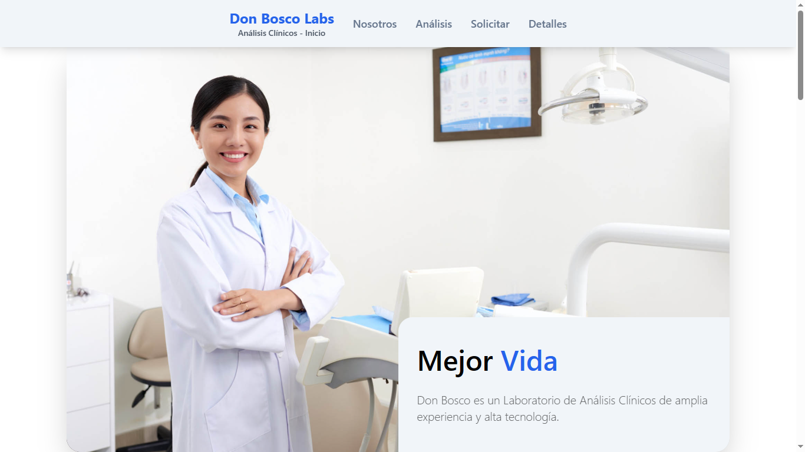

# Don Bosco Labs - Clinical Laboratory

## 🔷 Introduction

Web page proyect based on a fictitious clinical laboratory. Although it was a template with pure html and bootstrap css, the web was completely improved from scratch by using modern libraries such as ReactJS and TailwindCSS.

- Original Template: https://templatemo.com/tm-566-medic-care

## 🔷 Dependencies

- ReactJS
- Vite
- [TailwindCSS](https://tailwindcss.com/docs/installation)
- [React Icons](https://react-icons.github.io/react-icons/)
- [Toastify](https://www.npmjs.com/package/react-toastify)
- [Swiper](https://swiperjs.com/)

